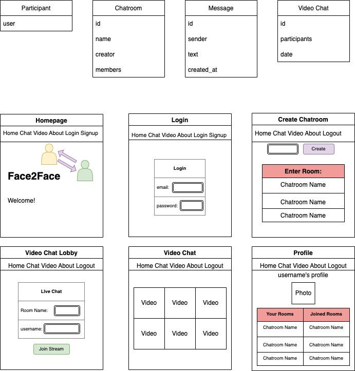
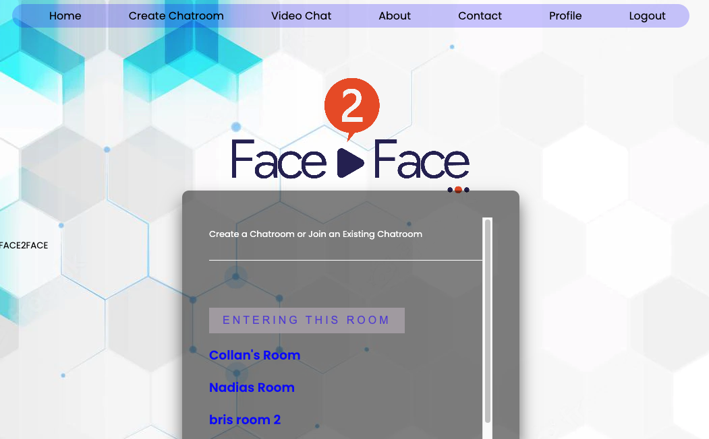

# Face2Face (United States)

Face2Face allows users to create and join virtual meeting rooms where they can communicate with each other using video, audio and instant messaging.


# Face2Face App

Visit Face2Face app website at: <a href=""> Face2Face</a>
<hr />

## Getting Started

`1` `Fork` & `Clone` this repo to your local computer.

`2` pip install packages
```text
pip3 install python-dotenv  
pip3 install psycopg2  
pip3 install agora_token_builder

```
<hr />

## Languages & Technologies

* `Django`
* `Postgres`
* Deployed to `Heroku`
* Agora video streaming

<hr />

## WireFrame


<hr />

## User Stories

* Face2Face allows users to create and join virtual meeting rooms where they can communicate with each other using video, audio and instant messaging. Additional future improvements include features that can give participants the ability to share their screen, share files, and use text chat within the meeting group or privately with others in the meeting.

<hr />

## App Pictures

* Home Page


<br/>

* Login


<br/>

* Create Chatroom


<br/>

* Video Chat Lobby


<br/>

* Video Chat Stream


<br/>

* Profile


<br/>


<hr />

## API's used

* Third party API: 
<br/>
<a href="https://www.agora.io/en/products/interactive-live-streaming/">Agora Video Streaming</a>
<br/>

AgoraRTC video chat is a feature of the AgoraRTC platform that allows users to communicate with each other using real-time video. To use AgoraRTC video chat, users need to connect to the Agora server using the AgoraRTC APIs and establish a video call with another user. AgoraRTC video chat supports high-quality video and audio, and uses techniques such as adaptive bitrate and echo cancellation to ###### ensure a smooth and clear communication experience. AgoraRTC video chat can be used in a variety of applications, including conferencing, gaming, education, and more. It can also be customized with additional features such as screen sharing and text messaging.

### Models
```python

class Participant(models.Model):
    user = models.ForeignKey(User, on_delete=models.CASCADE)

class Chatroom(models.Model):
    name = models.CharField(max_length=100)
    creator = models.ForeignKey(User, on_delete=models.CASCADE)
    members = models.ManyToManyField(Participant, blank=True)
    
    def __str__(self):
        return self.name
    
class Message(models.Model):
    sender = models.ForeignKey(User, on_delete=models.CASCADE)
    chatroom = models.ForeignKey(Chatroom, on_delete=models.CASCADE)
    text = models.CharField(max_length=300)
    created_at = models.DateTimeField(auto_now_add=True)
    
    def __str__(self):
        return self.text
    
class Video_Chat(models.Model):
    participants = models.ManyToManyField(Participant)
    date = models.DateTimeField(auto_now_add=True)
```
note: the Video_Chat model is not currently in use.

### URL Paths
```jsx
urlpatterns = [
    path('', views.index, name='index'),
    path('chatroom/create/', views.CreateChatroom, name='createChatroom'),
    path('<str:chatroom>/update/', views.edit_chatroom, name='edit_chatroom'),
    path('<str:chatroom>/delete/', views.delete_chatroom, name='delete_chatroom'),
    path('<str:chatroom>/<str:member>/delete/', views.delete_member, name='delete_member'),
    path('message/<str:chatroom>/create/', views.CreateMessage, name='create_message'),
    path('getMessages/<str:chatroom>/', views.getMessages, name='getMessages'),
    path('user/<username>/', views.profile, name='profile'),
    path('accounts/login/', views.login_view, name='login'),
    path('logout/', views.logout_view, name='logout'),
    path('signup/', views.signup_view, name='signup'),
    path('group/', views.chatroom, name='chat_room'),
    path('about/', views.about, name='about'),
    path('contact/', views.contact, name='contact'),
    path('room/', views.room),
    path('lobby/', views.lobby),
    path('get_token/', views.getToken),
]
```

### Code:
examples from main_app>views.py:
```jsx
@login_required
def CreateChatroom(request):
    if request.method == 'POST': 
        chatroom = request.POST['chatroom']
        creator = request.user
        if Chatroom.objects.filter(name=chatroom).exists():
            return redirect(f'/message/{chatroom}/create')
        else:
            new_room = Chatroom.objects.create(name=chatroom, creator=creator)
            new_room.save()
            return redirect(f'/message/{chatroom}/create')
    else: 
        all_chatrooms = Chatroom.objects.all()
        return render(request, 'createChatroom.html', {'chatrooms': all_chatrooms})

@login_required
def edit_chatroom(request, chatroom):
    chatroom = Chatroom.objects.get(name=chatroom)
    user = request.user
    members = list(chatroom.members.all())
    all_members = []
    for member in members:
        one_member = User.objects.get(id=member.user_id)
        all_members.append(one_member)
    if user == chatroom.creator and request.method == 'GET':
        return render(request, "edit_chatroom.html", {'chatroom': chatroom, 'members': all_members})
    elif user == chatroom.creator and request.method == 'POST':
        name = request.POST['name']
        chatroom.name = name
        chatroom.save()
        return redirect(f'/message/{name}/create/')
    else: 
        return redirect(f'/message/{chatroom.name}/create')

@login_required
def CreateMessage(request, chatroom):
    user = request.user
    chatroom = list(Chatroom.objects.filter(name=chatroom))[0]
    members = chatroom.members.all()
    # create new message
    if request.method == 'POST': 
        text = request.POST['text']
        new_message = Message.objects.create(sender=user, chatroom=chatroom, text=text)
        new_message.save()
        # check if user_id is already associated with participant instance
        participant_exists = Participant.objects.filter(user_id=user.id)
        # check to see if participant exists and needs to be added to chatroom instance
        if participant_exists and new_message.sender != chatroom.creator and participant_exists != members:
            new_member = Participant.objects.get(user_id=user.id)
            chatroom.members.add(new_member)
            chatroom.save()
            return render(request, 'main_app/message_form.html', {'user': user, 'chatroom': chatroom})
        # check to see if participant needs to be created and added to chatroom instance
        elif new_message.sender != chatroom.creator and new_message.sender != chatroom.members:
            new_member = Participant.objects.create(user=user)
            new_member.save()
            chatroom.members.add(new_member)
            chatroom.save()
            return render(request, 'main_app/message_form.html', {'user': user, 'chatroom': chatroom})
        else:
            return render(request, 'main_app/message_form.html', {'user': user, 'chatroom': chatroom})
    else: 
        return render(request, 'main_app/message_form.html', {'user': user, 'chatroom': chatroom})

```

## Texting Chatroom 
### Users are able to create a chatroom and/or join an existing chatrooms.
#### New Chatroom - 
  ##### Simply type a chatroom name within the input and select "entering this room"
  ##### 
#### Existing Chatroom - 
  ##### Select the existing chatroom and it redirects to that page. 
  ##### 
### Within the Chatroom 
#### Chatroom Header and Room name
  ##### 
#### Chat text 
 ##### 1. Username 2. Texting message 3. Date of the message created
 ##### 
#### Sending the message
  ##### 

#### 

### Some notable codes
#### Fetching Messages "GET"
    <script>
      $(document).ready(function () {
        setInterval(function () {
          $.ajax({
            type: "GET",
            url: "/getMessages/{{chatroom}}/",
            success: function (response) {
              console.log(response);
              $("#display").empty();
              for (let key in response.messages) {
                let displayMessage =
                  "<div class='padding-box box container darker'><b>" +
                  response.messages[key].sender.toUpperCase() +
                  "</b><p class='container font'>" +
                   response.messages[key].text +
                  "</p><span class='padding-box darker'>" +
                  response.messages[key].created_at.slice(0, 10)+
                  "</span></div>";
                $("#display").append(displayMessage);
              }
            },
            error: function (response) {
              alert("Your message has not been sent, An Error");
            },
          });
        }, 1000);
      });
    </script>

## Developers 

<div>
    <h3> Aiden Jang </h3>
        <a href="https://github.com/AidenValley">Github</a>
    <h3> Keara Harrington </h3>
        <a href="https://github.com/kearaharrington">Github</a>
    <h3> Calvin Moldenhauer </h3>
        <a href="https://github.com/Calvickauer">Github</a>
    <h3> Alejandro Moreno </h3>
        <a href="https://github.com/amoreno16003">Github</a>
</div>

# Face2Face Future Improvements:
```
- [ ] make chatrooms private
- [ ] view all live video chats
- [ ] save video chat history to database

```